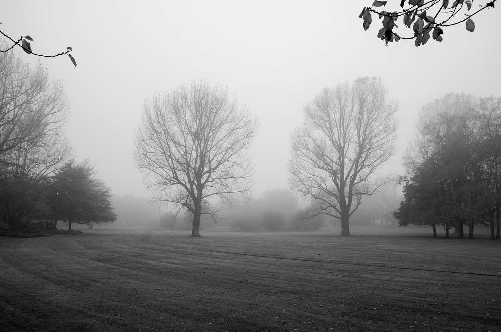
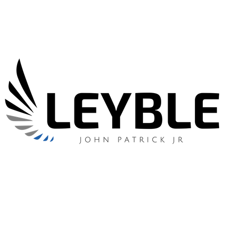
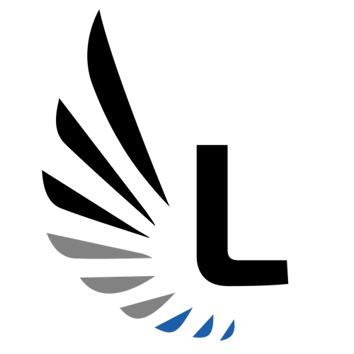

# **PROJECT 2** 
---
The purpose of the project is to create a personal static webpage that will showcase skills regarding HTML, CSS, and Designing.

---
* Website is live at https://patrickleyble.netlify.com
---

## **Designing Phase**

### Inspiration
The main concept of my webpage is to represent myself. I started choosing a color palette by looking at my wardrobe as it collectively demonstrate what color I like most. Eventually I decided that my main color pallete will focus on different shades of black and white, and look for a contrasting color to give a positive mood to the page.

### Image Selection
Images are gathered from [Pinterest](https://www.pinterest.com.au/) and [Pixabay](https://pixabay.com/)

Final image to use as background for the website is:

Image source: [emkanicepic](https://pixabay.com/en/tree-landscape-nature-fog-3080940/)
### Typography
Two serif fonts and two sans serif fonts from [google fonts](https://fonts.google.com/) were chosen for typography matching.

Serif
* Lato
* Roboto Condensed

Sans Serif
* Karma
* Roboto Slab

### Color Palette
Three sets of color palette were generated using [coolors](https://coolors.co/).

* Color Palette 1

#FFFCF2,#CCC5B9,#828282,#252422,#1D5EA8

* Color Palette 2

#E5D4ED,#CCC5B9,#403D39,#252422,#6D72C3

* Color Palette 3

#778590,#57636E,#CAD1D6,#10141B,#EF7324

### Layout

Full layout and design is created using Figma. Logo is created using [Canva](https://www.canva.com/)

Full project design using Figma: [Figma Project Design](https://www.figma.com/file/SgTF5puUrDhLK78l2z3y8ySy/Project-2)

Main Logo:

Head Logo:

---
## FINAL RESULT

### Learning Outcome
- Utilise HTML and CSS, and gain knowledge in creating a static webpage.
- Develop a better understanding regarding designing.
- Learn to use different tools to design the basic layout and logo.
- Learn how to use Git and utilise Github as our main repository.

### Compatibility

#### Device
- Mobile device
- Ipad/tablet
- Desktop

#### Browser

- All browser

### Future Improvements

- Include animations
- Update design base on trend
- implelement future skill set to enhance website's interface 