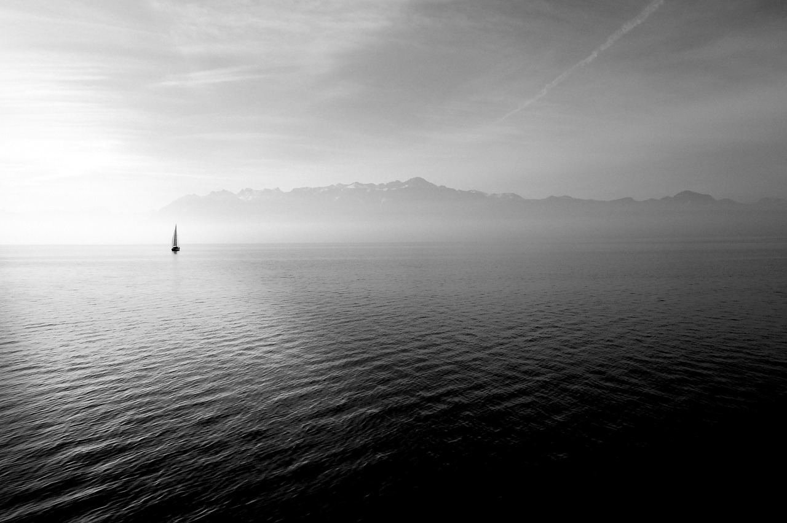

# **PROJECT 2** 

The purpose of the project is to create a personal static webpage that will showcase skills regarding html, CSS, and designing.

## **Designing Phase**

### Inspiration
The main concept of my webpage is to represent myself. I started choosing a color palette by looking at my wardrobe as it collectively demonstrate what color I like most. Eventually I decided that my main color pallete will focus on different shades of black and white, and look for a contrasting color to give a positive mood to the page.

--> insert image of wardrobe
### Image Selection
Images are gathered from [Pinterest](https://www.pinterest.com.au/) and [Pixabay](https://pixabay.com/)

#### Images:

Image source: [emkanicepic](https://pixabay.com/en/tree-landscape-nature-fog-3080940/)
### Typography
Two serif fonts and two sans serif fonts from [google fonts](https://fonts.google.com/) were chosen for typography matching.

Serif
* Lato
* Roboto Condensed

Sans Serif
* Karma
* Roboto Slab

### Color Palette
Three sets of color palette were generated using [coolors](https://coolors.co/). All sets have base colors of 2 different shades between black and white, and 2 additional colors that complements it.

* Color Palette 1

#FFFCF2,#CCC5B9,#828282,#252422,#1D5EA8

* Color Palette 2

#E5D4ED,#CCC5B9,#403D39,#252422,#6D72C3

* Color Palette 3

#778590,#57636E,#CAD1D6,#10141B,#EF7324

### Layout

### Figma

## HTML and CSS

## COMMENTS

## FINAL RESULT